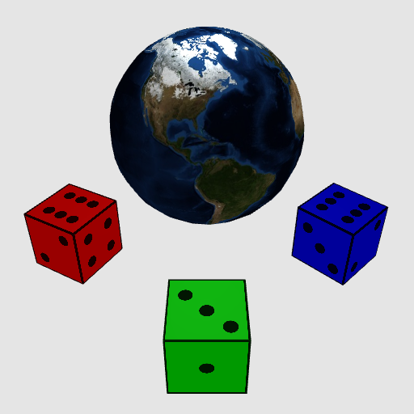

Creating Cubes and Earth!

In this assignment, you will implement shading, texturing and transformations for triangle meshes!

# Getting started
To run and develop this assignment you must start a local HTTP server in the directory containing `a4.html`.
The simplest way is using python.
In MacOS and Linux `python3 -m http.server` in a terminal should work out of the box.
For Windows or in case of any trouble, see these instructions: [https://developer.mozilla.org/en-US/docs/Learn/Common_questions/set_up_a_local_testing_server#running_a_simple_local_http_server](https://developer.mozilla.org/en-US/docs/Learn/Common_questions/set_up_a_local_testing_server#running_a_simple_local_http_server).
You may also use an IDE that can run a simple HTTP server for your workspace (e.g., the "Go Live" mode in VS Code, or similar functionality with IntelliJ).
Once the HTTP server is up, navigate your browser to [http://localhost:8000/a4.html](http://localhost:8000/a4.html).

# Implementation

I use the following syntax:
- `p,id,cube;` creates a unit cube mesh and gives it the name `id`
- `p,id,sphere,i,j`	creates a unit sphere mesh with name `id`, formed using `i` "stacks", and `j` "sectors"
- `m,id,ka,kd,ks,shininess,texture;` creates a Phong shader material named by `id`, with ambient (`ka`), diffuse (`kd`), specular (`ks`), and specular exponent (`shininess`) coefficients, and an optional texture image specified by `texture`.
- `X,id,T,x,y,z;` specifies a transformation that translates object `id` by `(x,y,z)`.
- `X,id,R?,theta;` specifies a rotation of object `id` around axis `?` (i.e. `Rx` rotates around `x` etc.), by counter-clockwise angle in degrees `theta`.
- `X,id,S,x,y,z;` specifies a scale transformation of object `id` by scale factors `(x,y,z)` along each axis.
- `o,id,prim,mat;` adds an object to the scene with name `id`. The object uses the primitive mesh with id matching `prim` and the Phong shader material with id matching `mat`. Note this is the way to actually add an object into the scene (i.e. primitives and materials are not part of the scene until they are used by an object).
- `l,id,type,x,y,z,ir,ig,ib;` sets the light (with name `id`) and light type `type` at position `(x,y,z)` with intensity `(ir,ig,ib)`. We only support a single light of type `point`.
- `c,id,type,ex,ey,ez,lx,ly,lz,ux,uy,uz;` sets the camera to be placed at position `(ex,ey,ez)` and looking towards `(lx,ly,lz)` with up axis `(ux,uy,uz)`. We only support a single camera of type `perspective`.

You can change the contents of the text box to define new primitives, materials, and objects that use them, as well as to change the light and camera parameters.
Clicking the "Update" button will refresh the image output.
The starter code will produce some a rectangle and triangle close to the origin both shaded with a "debug" temporary color.

Note that the default input defines quite a bit more information, including materials, and transformations for several cube objects and a sphere object.
You will likely want to user simpler inputs at the beginning as you get started (e.g., just one unit cube when implementing cube triangle mesh generation).
Later, as you get more functionality implemented, you can start to use more features.

## Triangle Mesh Generation

First, I implement the unit cube and unit sphere triangle mesh creation logic in `createCube` and `createSphere` respectively.
I populate the `positions`, `normals`, `uvCoords`, and `indices` members of the `TriangleMesh` within each of these two functions (creating an indexed triangle mesh, i.e. "vertex list" + "index list" representation).
The unit cube should have bottom-left-front corner `-1,-1,+1` and top-right-back corner `+1,+1,-1`.
For the cube, I use a "triangle soup" encoding (i.e. repeat vertices that are shared at corners of the cube, and leave the `indices` unpopulated).
The surface normals at each vertex of the cube should point in the direction of the cube's face surface normal (note that you will need to repeat vertex positions to define distinct normals for each face at a "corner").
The unit sphere should be centered at the origin and have radius equal to `1`.
I use the "stacks and sectors" approach to create a triangle mesh sphere using spherical coordinates.
This time, I encode vertex indices into `indices` as that is easier than trying to create an unindexed "triangle soup" for the sphere.
I find the following description of the stacks and sectors algorithm at [http://www.songho.ca/opengl/gl_sphere.html](http://www.songho.ca/opengl/gl_sphere.html) algorithm to be useful.
For the sphere, the surface normals at vertices should point outwards from the center of the sphere.

## Transformations 

Now, I implement transformations to position triangle meshes.
In function `computeTransformation` you will receive a sequence of transformations defined in the input text for a specific object, and you will need to compute the overall 4x4 transformation matrix.
Note that the `transformSequence` parameter to the function contains an array of transformation definitions (using the syntax defined above), in the order in which they should be applied to the object.
Also note that rotations are defined in degrees in the input text, but you will likely want to convert to radians to compute the transformation matrices.

## Shading 

Next, let's start to implement shading.
I add shading logic into the `VERTEX_SHADER` and `FRAGMENT_SHADER` GLSL code.
This overview of WebGL and GLSL shaders is I referred for: [https://webglfundamentals.org/webgl/lessons/webgl-shaders-and-glsl.html](https://webglfundamentals.org/webgl/lessons/webgl-shaders-and-glsl.html).
First, implement the ambient and Lambertian components of the Blinn-Phong reflection model (using the `ka` and `kd` coefficients).
Then, implement and add the specular component (using the `ks` and `shininess` coefficients).
I defined and use direction vectors corresponding to the surface normal, the camera view direction, and the light direction.
A useful debugging strategy when working with shaders is to set the fragment color according to some value that you want to check (e.g., mapping a dimension of the normal vector to a color channel, or a dot product to another color channel).

## Texturing 

Finally, implement texturing by using the interpolated texture coordinates (`vTexCoord`) and the texture sampler (`uTexture`) in the fragment shader.
If the material specifies a texture, modulate the color from Blinn-Phong shading by the texture color (i.e. multiply the shaded color and the texture color).
The uniform boolean variable `hasTexture` specifies whether the material has a texture.
Note that we provide two texture image files: `dice.jpg` and `globe.jpg`.
A correctly textured sphere primitive will display a globe that is upright and shows North America when parsing the default input handed out with the project (see output image below).
A correctly textured cube primitive will display the six faces of a [right-handed die](https://en.wikipedia.org/wiki/Dice#Arrangement), with the "one dot" face being the front face of the cube, i.e. having bottom left coordinates -1,-1,1 and top right coordinates 1,1,1.
If you "unwrap" the faces they should look like ⚅⚄⚀⚁, with ⚂ above ⚅, and ⚃ below ⚅.
I thought about how to define the corners of each face, and therefore what the UV coordinates at each vertex should be.
See the following illustration which indicates a couple of vertex positions and the mapping of cube faces to the texture image: 

## Creative!

Do something creative!
Now that you can shade, transform, and texture meshes, have fun with creating an interesting and visually appealing image.
Make sure to save the input text that produces this creative artifact into the `DEF_INPUT` variable.

## Checking

The default input should produce an image like the below when you have correctly implemented all parts of the project:

